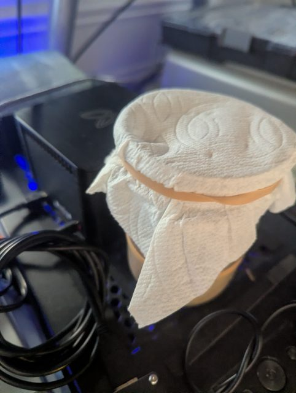

# bfl-asic

**A model-free characterization lab for retro mining silicon.** It began as a toolkit for a single device — a 2013 Butterfly Labs BF0005G "Jalapeño" SHA-256 ASIC, resurrected from a decade as a paperweight into a hardware research platform — and has grown into a small lab for characterizing retro mining hardware generally. The Jalapeño is still the protagonist, but the device-agnostic core (nonce-source characterization, dead-core health, thermal/throughput profiling) now spans a fleet.

> **On the name:** `bfl-asic` is where this started and it stays for continuity — the published dataset, two blog posts, and the release all point at it. The *scope* is deliberately broader than the name; think of it as "the BFL toolkit, grown up."

Beyond the hardware, it also provides statistical analysis of SHA-256 hash output, iterated-hash dynamics exploration, NIST SP 800-22 randomness validation, and an optional round-reduced-SHA-256 ML learnability instrument — all through a layered Python API.

- **Writeup:** [Teaching a Dead Mining ASIC to Measure Nothing, Carefully — the story & the negative results](blog/round-reduced-sha256-learnability.md) (also published as a Hugging Face Article — link added on publish)
- **Writeup:** [I Thought I Found Hidden Commands in a 2013 Mining ASIC. They Were in the Firmware All Along.](blog/jalapeno-command-surface.md) — re-deriving the command surface, characterizing the silicon, and one new instrument
- **Dataset:** [`bshepp/round-reduced-sha256-learnability`](https://huggingface.co/datasets/bshepp/round-reduced-sha256-learnability)
- **Study:** [BFL Jalapeño production census](docs/production-census.md) — how many were built, estimated from serial numbers (~28,000; the German-tank method + the FTC "built-not-shipped" angle)

## Devices

The lab characterizes a growing fleet of retro mining ASICs. Each speaks a
different serial protocol, but they share one honest trait — they emit only
winning *nonces*, never full digests — so the device-agnostic core
(`characterize_source`, dead-core `health`) profiles them all the same way.

| # | Device | ASIC | Protocol | Status |
|---|--------|------|----------|--------|
| 1 | **BFL Jalapeño** (BF0005G, ~5 GH/s) | BitForce SC — AVR32 MCU + fixed SHA die | BitForce SC (`Z_X` ASCII) | Protagonist; fully characterized (a 2nd, sacrificial unit backs the invasive work) |
| 2 | **ASICMiner Block Erupter** (~336 MH/s) | BE100 — dumb pipe, no MCU | Icarus (64B work → 4B nonce) | Characterized |
| — | **Antminer U1 / U2** | BM1380 | Icarus + ANU frequency control | Incoming — the clock-sweep lever the Jalapeño denied us |
| — | **GekkoScience NewPac** | BM1387 ×2 | gekko chain (per-chip nonce attribution) | Incoming — dead-core ground truth |
| — | **Govee H5075** (BLE) | — | ambient temp/humidity advertisement | Incoming — independent ambient reference |

### Device #1 — BFL Jalapeño (the origin)

- **ASIC:** BitForce SHA256 SC 1.0 (Single Chip), ~5 GH/s
- **Interface:** USB serial via FTDI (VID `0x0403`, PID `0x6014`), 115200 8N1
- **Protocol:** ASCII commands (ZGX, ZLX, ZTX, ZDX, ZFX, ZPX; SC queued ZNX/ZOX/ZCX) with 60-byte binary work packets
- **MCU:** Atmel AVR32 `AT32UC3A1256` running the open `luke-jr/BitForce_SC` firmware (JTAG-debuggable)
- **Power:** 12V DC brick for the miner; USB data through a required ADuM3160 isolator

<p>
  <a href="docs/images/jalapeno-rig.jpg">
    
  </a>
  <br><sub><em>The rig in situ — the BF0005G Jalapeno (left). The sourdough starter really does live right next to it. Click to enlarge.</em></sub>
</p>

*Where the fleet could grow: [`docs/future-directions.md`](docs/future-directions.md) (speculative expansion map), [`docs/hardware-wishlist.md`](docs/hardware-wishlist.md) (near-term gear), and [`docs/usb-miner-field-guide.md`](docs/usb-miner-field-guide.md) (the full 2011–2018 catalog).*

## Installation

```bash
pip install -e .
```

Requires Python 3.10+. Dependencies: `pyserial`, `pyserial-asyncio`, `click`, `numpy`, `scipy`, `matplotlib`. Optional extras: `pip install -e ".[ml]"` (PyTorch, for the learnability instrument) and `pip install -e ".[ambient]"` (bleak, for the Govee H5075 BLE reader).

## Quick Start

### With hardware connected

```bash
# Discover devices
bfl-asic discover

# Probe device on COM3
bfl-asic -p COM3 probe

# Read temperature and voltages
bfl-asic -p COM3 temperature

# Full ZCX device census: firmware, engine count, real clock,
# per-processor topology, and any undocumented firmware fields
bfl-asic -p COM3 device details

# Undocumented probe commands (unverified in cgminer; real on hardware)
bfl-asic -p COM3 device firmware        # ZJX -> bare version string
bfl-asic -p COM3 device note            # ZUX -> read NVRAM scratch string

# Sustained-work characterization: throughput, nonce histogram, dead-core health
bfl-asic characterize --duration 60 -o run.json   # auto-detects the port

# Dead-core detection from a saved characterization run (no hardware)
bfl-asic device health --from-run docs/characterization/engine-map.json
bfl-asic device health --demo --inject-dead 0.3:0.4 --engines 27  # show it working

# File a bug / feature request (opens a prefilled GitHub issue)
bfl-asic report-issue --title "..." --kind feature

# No --port needed: bfl-asic auto-detects a connected device, else uses the simulator
bfl-asic device details

# Benchmark work submission throughput
bfl-asic -p COM3 benchmark --duration 10
```

> **Device census (`ZCX`).** `device details` parses the complete device
> reply, not just the handful of fields cgminer consumed. On real
> hardware this surfaces undocumented fields — a firmware-estimated
> hashrate, a `CRITICAL TEMPERATURE`, and a per-processor engine/clock
> breakdown (`PROCESSOR N: X engines @ Y MHz`) that exposes the chip's
> internal topology. Anything unrecognised is still printed verbatim
> under "Other fields". `scripts/hw/read_details.py` is a strictly
> read-only capture of the same reply (no work queued, no fan touched,
> no NVRAM written).

### Without hardware (simulator)

```bash
# All commands work with --simulate or with no --port flag
bfl-asic --simulate probe
bfl-asic --simulate identify
bfl-asic --simulate hash "hello world"
```

### Statistical analysis

```bash
# Run SHA-256 statistical analysis (software engine)
bfl-asic stats run --samples 100000 -o snapshot.json --plot

# View saved results
bfl-asic stats report snapshot.json

# Animated visualisation of per-bit bias shrinking as N grows
# (great for an intuitive feel for the law of large numbers)
bfl-asic stats animate-convergence --samples 100000 --frames 60
```

### Iterated hash dynamics

```bash
# Run orbit/convergence analysis
bfl-asic dynamics run --seeds 5 --max-iterations 50000 -o dynamics.json

# Generate plots from saved results
bfl-asic dynamics plot dynamics.json
```

### Randomness validation (NIST SP 800-22)

```bash
# Harvest hashes and run the NIST randomness battery
bfl-asic randomness run --hashes 1000 -o randomness.json

# View saved results
bfl-asic randomness report randomness.json
```

Six tests are included: frequency (monobit), block frequency, runs,
longest run of ones in a block, DFT spectral, and cumulative sums
(forward + reverse).  The battery consumes any `HashSource`, so an
ASIC-backed source plugs in unchanged.

### Sustained device work (SC queued path)

The naive `ZDX`/`ZFX` path stalls after roughly **42 submissions** because
the firmware queue fills and never gets drained — not a hardware ceiling.
`QueuedWorkSession` speaks the SC queued protocol (`ZNX`/`ZWX` + continuous
`ZOX` result-drain + `ZCX` `JOBS IN QUEUE` backpressure) exactly as
cgminer/bfgminer do, and runs unbounded with no power-cycling required.
`NonceSource` wraps `QueuedWorkSession` as the honest device surface: it
yields **nonces** (mining winners), not full digests — it is **not** a
`HashSource` and cannot feed the statistical/randomness battery directly.

```bash
# Fan control — thermal safety caveat applies
bfl-asic -p COM3 fan auto       # restore firmware thermal management (default)
bfl-asic -p COM3 fan 2          # fixed level 0-4 (0 = off, 4 = full)
```

Warning: a low fixed fan level during active hashing can cause thermal
damage to the ASIC.  The setting is persistent until changed or the device
is power-cycled.  Always restore with `fan auto` when done.

### ML learnability instrument (optional [ml] extra)

````markdown
```bash
pip install -e ".[ml]"

# Where does SHA-256 become unlearnable? (round-reduced sweep)
bfl-asic ml sweep --rounds 1,2,4,8,16,32,64 --plot

# Rigorous "is there ANY structure in full SHA-256?" bounded null
bfl-asic ml run full_structure

# Iterated-hash orbit learnability vs truncation width
bfl-asic ml run dynamics
```

Requires PyTorch (installed only via the optional `[ml]` extra). The
rest of the toolkit runs without it.
````

### Where outputs go

When you do not pass `-o`, results land under a `runs/` folder in the
current directory, organised by command:

```
runs/
  stats/<timestamp>/snapshot.json + dashboard.png   (stats run --plot)
  animations/convergence-<timestamp>.gif            (stats animate-convergence)
```

Explicit `-o paths/file.ext` is always honoured verbatim.  Two writes to
the same path never overwrite each other -- the second one is suffixed with a
timestamp.  Override the output root with the `BFL_ASIC_OUTPUT_DIR`
environment variable.

## Architecture

```
bfl_asic/
  protocol/       # Pure encoding/decoding — no I/O
    constants.py   # Baud rate, commands, timing, response tokens
    commands.py    # Build ZGX, ZLX, ZTX, ZDX, ZFX, ZPX byte sequences
    responses.py   # Parse identify, temperature, voltage, work results
    queued.py      # SC queued protocol + ZCX DeviceDetails census
    probe.py       # Undocumented ZJX/ZUX/ZSX builders + lenient parsers
    work.py        # SHA-256 midstate computation, synthetic work generation
    freq.py        # ZVX/ZKX frequency-factor commands (Jalapeno)
    icarus.py      # Icarus protocol (Block Erupter / Antminer U): 64B work -> 4B nonce + ANU frequency
  transport/       # I/O abstraction
    base.py        # BaseTransport ABC (sync + async)
    serial.py      # Real hardware via pyserial
    simulator.py   # In-process simulated device with thermal model
    icarus_simulator.py # Headless simulated Icarus device (Block Erupter)
    discovery.py   # FTDI device scanning
  stats/           # SHA-256 statistical analysis pipeline
    engine.py      # HashSource ABC, SoftwareHashEngine
    accumulators.py # Bit frequency, avalanche, correlation, entropy, etc.
    spectral.py    # FFT-based periodicity detection
    snapshot.py    # JSON-serializable results
    pipeline.py    # Orchestrator wiring engine → accumulators → snapshot
    visualization.py # Matplotlib plots: heatmaps, histograms, dashboards
  dynamics/        # Iterated hash dynamics (x → SHA-256(x) → ...)
    orbit.py       # Orbit computation with sampled trajectories
    rho.py         # Floyd's and Brent's cycle detection (O(1) memory)
    convergence.py # Multi-seed convergence analysis
    visualization.py # Orbit, convergence, and distribution plots
  randomness/      # NIST SP 800-22 randomness test battery
    tests.py       # Pure-function tests over uint8 bit arrays
    battery.py     # Orchestrator over any HashSource
    snapshot.py    # JSON-serializable results
  ml/              # Optional learnability instrument (torch behind [ml])
    roundreduced.py # Numpy-vectorized round-reduced SHA-256
    datasets.py     # Feature extractors + distinguisher/orbit datasets
    models.py       # TinyCNN + LinearProbe
    harness.py      # Deterministic train/eval + pos/neg controls
    experiments.py  # The four named experiments
    snapshot.py     # JSON-serializable results
    visualization.py # Learnability curve + saliency map
    publish.py      # Optional HF model-card upload
  health.py        # Dead-core detection from the winning-nonce histogram
  characterization.py # Device-neutral sustained-work characterizer (any NonceSource)
  nonce_source.py  # Honest nonce streams — BFL queued path + Icarus
  ambient.py       # Govee H5075 BLE ambient temp/humidity decoder
  device.py        # BFLDevice — sync high-level API
  async_device.py  # AsyncBFLDevice — async API with stream iterators
  cli.py           # Click CLI: identify, temperature, device details,
                   #   probe, discover, benchmark, hash, stats, dynamics,
                   #   randomness
  exceptions.py    # BFLError hierarchy
```

### Layer separation

- **Protocol** is pure Python — no I/O, no state, fully testable
- **Transport** abstracts serial vs simulator vs future backends
- **Device** combines transport + protocol into a clean API
- **Applications** (stats, dynamics, randomness) are independent of the device layer

## Dead-core detection (`bfl_asic/health.py`)

The device only ever returns winning *nonces*, so its health leaks
through *where* in the 32-bit nonce space those winners land. A working
engine that scans a contiguous sub-range contributes winners across that
range; a **dead** engine leaves a cold (under-represented) band. The
detector histograms winning nonces and flags contiguous runs of bins that
sit far below the mean (a per-bin Poisson test), estimating how many
engines are dead from the cold fraction:

```python
from bfl_asic.health import detect_dead_cores_from_counts
import json
run = json.load(open("docs/characterization/engine-map.json"))
nd = run["nonce_distribution"]
print(detect_dead_cores_from_counts(nd["counts"], nd["n"], engines=27).summary())
# -> Engine health: 17726 nonces over 256 bins (mean 69.2/bin)
#    verdict: HEALTHY (no dead cores detected)
```

**Key limitation, stated plainly:** this localizes a dead engine only if
engines cover *contiguous* nonce ranges. If they interleave the space, a
dead engine thins the whole histogram uniformly and is invisible here —
the overall nonce *yield rate* is the signal instead. An aggregate
histogram can expose a dead region but cannot *map* the healthy partition
(healthy engines sum to uniform). See
[`docs/characterization/README.md`](docs/characterization/README.md).

## Protocol Reference

| Command | Bytes | Response |
|---------|-------|----------|
| Identify | `ZGX` | `BitForce SHA256 SC 1.0\n` |
| Temperature | `ZLX` | `Temp1: 30, Temp2: 30\n` |
| Voltages | `ZTX` | `3564,1011,11420\n` (mV: VCC1, VCC2, VMAIN) |
| Device census | `ZCX` | multi-line `KEY: VALUE` block → `OK\n` (firmware, engines, frequency, per-processor topology, `JOBS IN QUEUE`, …) |
| Firmware | `ZJX` | bare version string (e.g. `1.0.0`), no framing |
| Load string | `ZUX` | NVRAM scratch string (or `MEMORY EMPTY`); no newline, one stray trailing byte |
| Save string | `ZSX` + `[len][payload]` | writes **non-volatile** NVRAM scratch (survives power cycle) |
| Submit work | `ZDX` + 60-byte packet | `OK\n` |
| Poll result | `ZFX` | `IDLE\n` / `B\n` / `NONCE-FOUND:<hex>\n` / `NO-NONCE\n` |
| Nonce range | `ZPX` + 68-byte packet | `OK\n` |

**Provenance (not a discovery).** `ZJX` (firmware) is in BFL's official
2012 protocol spec, and so is `ZMX` — **Blink** (an LED identify). cgminer
calls it `bflsc_flash_led` ("flash the LED"), which is correct — that name
initially misled us into thinking `ZMX` was a firmware-flash command; it
is not, and there is no serial firmware-flash command. `ZSX`/`ZUX` (the NVRAM save/load
string) aren't in the published spec but are fully implemented in BFL's
open-source firmware ([`luke-jr/BitForce_SC`](https://github.com/luke-jr/BitForce_SC),
`Protocol_save_string`/`load_string`, the literal `"MEMORY EMPTY\n"`). We
re-derived them from hardware because the mining software (cgminer)
defines but never sends them. So: re-derivation and confirmation, not
discovery. The scratchpad is genuinely non-volatile (survives a power
cycle). Queued-job submit (`ZNX`) is acked with `OK` **or** `INPROCESS:<n>`
under load — both are accepts (only an `ERR:` reply is a rejection).

The `ZCX` census parses into a `DeviceDetails` with typed accessors —
`firmware`, `engines`, `frequency` / `frequency_mhz`, `mining_speed`,
`critical_temperature`, `xlink_mode`, `processors` (a list of
`Processor(index, engines, mhz)`), and `jobs_in_queue`. Lookups are
case- and dash-insensitive, so the wire's `--DEVICES IN CHAIN` resolves
cleanly. Reported fields vary by firmware build: the reference unit
returns `FREQUENCY: [UNKNOWN]` and no per-processor lines, while other
builds populate a real clock and the full topology.

Work packet format (60 bytes): `>>>>>>>> [32-byte midstate] [12-byte tail] >>>>>>>>`

## Testing

```bash
python -m pytest tests/ -q
```

890 tests. All tests run against the simulator — no hardware needed. Test coverage includes protocol encoding/decoding, the `ZCX` device-details census parser (with a real captured hardware reply as a regression fixture), dead-core detection (injected nonce-space gaps), the Icarus protocol (work/nonce + ANU frequency control, byte-exact from cgminer) and the H5075 ambient decoder, transport lifecycle, simulator state machine, device API round-trips, CLI smoke tests, statistical accumulators, dynamics algorithms, NIST SP 800-22 tests (with reference p-values from the spec as regression anchors), and visualization. Heavy ML training tests are marked `slow`; the default fast run (`pytest -m "not slow"`, 888 tests) excludes them. The ML subsystem requires `pip install -e ".[ml]"`; its tests skip cleanly when torch is absent.

## Python API

```python
from bfl_asic import BFLDevice
from bfl_asic.transport.serial import SerialTransport
from bfl_asic.transport.simulator import SimulatorTransport

# Real hardware
with BFLDevice(SerialTransport(port="COM3")) as dev:
    info = dev.identify()
    temp = dev.get_temperature()
    volts = dev.get_voltage()
    details = dev.get_details()          # full ZCX census
    print(details.firmware, details.engines, details.frequency_mhz)
    for p in details.processors:         # per-processor topology
        print(f"proc {p.index}: {p.engines} engines @ {p.mhz} MHz")
    nonces = dev.hash_data(b"hello world")

# Simulator
with BFLDevice(SimulatorTransport()) as dev:
    info = dev.identify()

# Async
from bfl_asic import AsyncBFLDevice
async with AsyncBFLDevice(SimulatorTransport()) as dev:
    async for nonces in dev.hash_stream(count=100):
        print(nonces)
```

```python
# Statistical analysis
from bfl_asic.stats import StatsPipeline

pipeline = StatsPipeline()
snapshot = pipeline.run(samples=100_000)
snapshot.save("results.json")
print(f"Max bias: {snapshot.bit_frequency['max_bias']}")
print(f"Mean Hamming: {snapshot.avalanche['mean']}")
print(f"Entropy: {snapshot.entropy['shannon_entropy']}")
```

```python
# Iterated hash dynamics
from bfl_asic.dynamics import brent_detect, compute_orbit
from bfl_asic.dynamics.orbit import sha256_iterate

# Truncated hash for reachable cycles
def toy_hash(v: bytes) -> bytes:
    import hashlib
    return hashlib.sha256(v).digest()[:3].ljust(32, b'\x00')

cycle = brent_detect(b'\x00' * 32, max_steps=1_000_000, hash_fn=toy_hash)
if cycle:
    print(f"Cycle length: {cycle.cycle_length}, Tail: {cycle.tail_length}")
```

```python
# NIST SP 800-22 randomness validation
from bfl_asic.randomness import RandomnessBattery
from bfl_asic.stats.engine import SoftwareHashEngine

battery = RandomnessBattery(engine=SoftwareHashEngine())
snapshot = battery.run(hash_count=1000)  # 256,000 bits
print(f"Passed: {snapshot.pass_count}/{len(snapshot.results)}")
for r in snapshot.results:
    print(f"  {r['name']:<28} p={r['p_value']:.4f}  "
          f"{'PASS' if r['passed'] else 'FAIL'}")
```

## Learning

If you're using this toolkit to learn SHA-256 and cryptography from
first principles, see **[LEARNING.md](LEARNING.md)** for a six-week
study path that pairs each subsystem with free Coursera and YouTube
lecture material.

## License

MIT — see [LICENSE](LICENSE). The published results dataset
([huggingface.co/datasets/bshepp/round-reduced-sha256-learnability](https://huggingface.co/datasets/bshepp/round-reduced-sha256-learnability))
is MIT as well.
