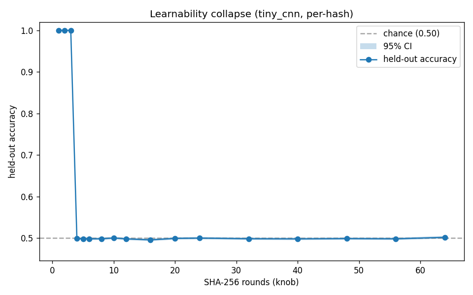
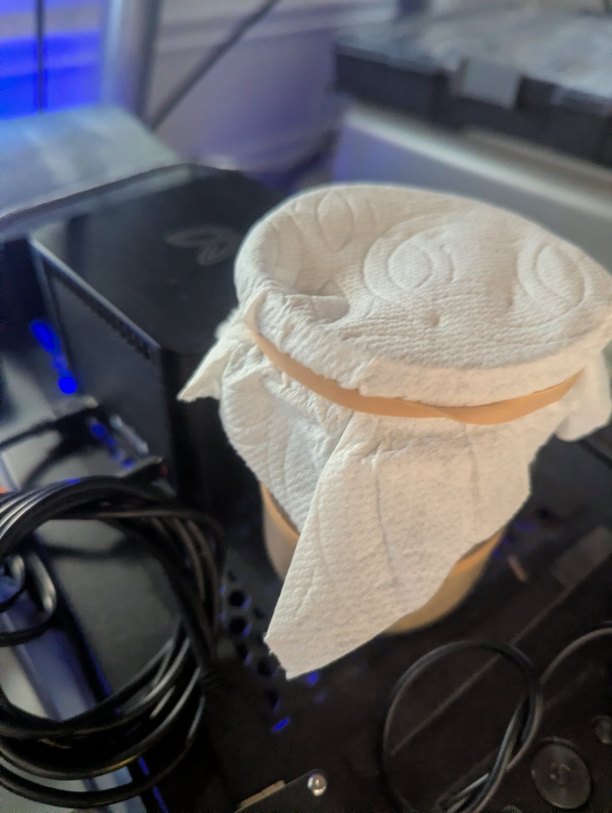

<!--
This is the long-form CANONICAL writeup. It is meant to be read
rendered as Markdown on GitHub (linked from the README), not pasted
into HF: the HF Posts surface is short and does not take this much
Markdown. For HF, post `blog/hf-post.txt` (short, plain text, links
back here). Keep this file as the full version of record.
Alternate titles: "The Round-4 Cliff: A Controls-Gated SHA-256
Learnability Study on Repurposed Mining Hardware"; "What a Defunct
Bitcoin Miner Taught Me About Negative Results".
-->

In 2013, Butterfly Labs shipped a small brushed-aluminum box called the Jalapeno: a 5 GH/s SHA-256 mining ASIC that was obsolete almost the moment it arrived. Mine sat dead for a decade. This project started as an attempt to resurrect it (a clean protocol layer, a serial transport, a device simulator) and then kept going, past "make the hardware talk" and into a question I actually cared about: **how much structure can a small, cheap model learn in SHA-256, and how would I know if I were fooling myself?**

This post is about the second part. Three findings came out of it, and the most useful one is a negative result that my own measurement caught itself getting wrong.

## The question, scoped honestly

I want to be precise about what this is *not*. It is not an attack on SHA-256. It is not a randomness proof. It is not run on the ASIC. The learnability experiments are software (numpy/PyTorch, anchored to `hashlib`), trained on CPU and a Hugging Face `cpu-xl` job. The Jalapeno is the project's origin and its hardware context, not its compute.

What it *is*: a learnability instrument. Given real SHA-256 and a round-reduced variant, can a tiny model tell them apart from a cheap per-hash feature? "Cheap" and "tiny" are the point. This measures *easy* learnability (the appropriate first question), not the limit of what some unbounded model could ever extract.

## What I built

The instrument has three parts. A **distinguisher dataset**: real SHA-256 vs an `R`-round-reduced compression function, balanced, with a per-hash feature. The feature is deliberately weak (a compact per-hash summary, not the raw bytes), so a positive result means structure that is *easy* to surface, and a negative one is bounded by exactly that cheapness, which I keep explicit rather than buried. Two deliberately small models: a TinyCNN and a linear probe. And a **deterministic harness** with the part that actually matters: a positive control (a low-round variant that *must* be learnable) and a negative control (random-vs-random, which must *not* beat chance). A "no structure" result is only trustworthy if the positive control learned and the negative control failed. If either control misbehaves, the instrument is broken and no result from it counts.

One piece of vocabulary, because it carries the honesty of the whole project: the **CI-resolution floor**. It is the smallest above-chance gain whose 95% confidence interval clears chance at a given evaluation size. It is *not* a power-based minimum detectable effect. "No structure detected" always means "none above this floor at this budget," never "the effect is zero."

## Finding 1: the round-4 cliff

Round-reduced SHA-256 is trivially distinguishable for the first few rounds and then it isn't. Rounds 1–3: accuracy 0.9998–1.0. Round 4 and beyond: it collapses to chance and stays there to the full 64.

That cliff is sharp, and it reproduces: five seeds across two compute tiers (Tier A at n=200k ×3 seeds, Tier B at n=500k ×2 seeds) and a finer round grid. Of the 55 points sitting past the cliff, exactly **one** has a 95% CI lower bound above chance. That point is Tier A, seed 1, round 6 (accuracy 0.50565, CI lower bound 0.50074). That is *fewer* than the ≈2.7 spurious one-sided 95% exceedances you'd expect from 55 independent points by chance alone. I'm not hiding it behind a smoothed average; it ships in the dataset as a per-point `learnable` flag precisely so you can find it and judge it yourself.

One more guard: is the cliff just an artifact of that one cheap feature? A second, structurally different feature (a per-batch deviation map, probed at n=2M) reproduces the same round-4 boundary (qualitatively, at a coarser resolution): learnable through round 3, at chance from round 4 onward. The cliff is a property of the round-reduced function, not of the particular probe I happened to pick.

## Finding 2: a bounded null on full SHA-256

For full 64-round SHA-256, the best of {TinyCNN, linear probe} sits at chance: the 95% CI brackets 0.5 for every seed, and the controls pass. "The controls pass" is load-bearing here: the same harness's positive control learned a low-round variant cleanly and its negative control stayed at chance, so this null is the instrument working, not the instrument failing silently and a null falling out by default. At n=800k the CI-resolution floor is ≈0.49%. To tighten it I ran a dedicated probe at **n=4,000,000** on a Hugging Face `cpu-xl` job: accuracy 0.500065, 95% CI [0.49897, 0.50116], controls green. That pushes the floor down to ≈**0.22%**.

Here is the careful sentence: this is a **bounded null at this budget**. It says these cheap probes find no structure in full SHA-256 above a ~0.22% advantage. It does *not* say SHA-256 is random, and it is *not* a power calculation. A bounded null is a measurement with a stated resolution, not a proof. Saying exactly that, and no more, is the whole discipline.

## Finding 3: the signal that wasn't

The most instructive result is the one I initially got wrong. In an iterated-hash dynamics experiment (predict a binned orbit-tail length from the seed), an early, under-validated harness reported above-chance accuracy. A signal! Tempting.

Then the negative control fired. A **permuted-label control** trains the same model on shuffled labels: if it still "beats chance," the apparent signal is a dataset or setup artifact, not learnable structure. The permuted-label model scored *identically*. The "signal" was the non-uniform label prior: the model was predicting the most common bin, not learning anything about the seed. The rebuilt harness (real Clopper-Pearson intervals plus the permuted-label control) converted a false positive into a correct, controlled **negative**. That conversion is not a footnote. It is the point of building controls at all.

## Why this shape of result matters

None of these findings is a breakthrough, and that is fine. The value is in the *shape*: a sharp, reproduced phase boundary; a bounded null stated with its resolution; and a negative that the instrument validated against itself. Negative results and bounded nulls are underpublished precisely because they're unglamorous, which is exactly why a small, careful one is worth writing down. The design goal was an instrument that is hard to fool, and the dynamics result is the proof it can catch me when I am. The training data isn't hosted: it's deterministic and regenerable from a seed, which is cheaper and more honest than a download. What's published is the distilled evidence: four Parquet tables, 83 rows, every number traceable.

## Artifacts and reproduction

- **Dataset:** [`bshepp/round-reduced-sha256-learnability`](https://huggingface.co/datasets/bshepp/round-reduced-sha256-learnability): the learnability sweep, the bounded null, the validated dynamics negative, and a feature-robustness check, with the controls carried on every row.
- **Code (MIT):** [`github.com/bshepp/bfl-asic`](https://github.com/bshepp/bfl-asic): the full toolkit. `pip install -e ".[ml]"`, then regenerate any result from its seed; the harness is deterministic.

## Close

A dead mining ASIC turned out to be a good teacher for an unglamorous skill: measuring nothing, carefully. The cliff is real. The null is bounded, and labeled as bounded. The one apparent signal was an artifact, and the control said so before I did. If you want to argue with any of it, the evidence is one `load_dataset` away.
