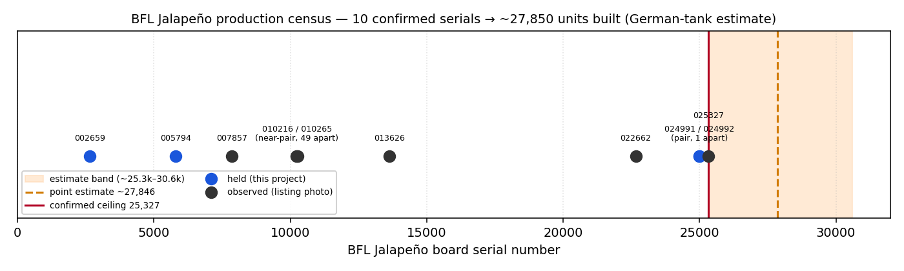

# BFL Jalapeño production census

An independent estimate of **how many Butterfly Labs BF0005G "Jalapeño"
SHA-256 ASIC miners were actually built** — derived from confirmed serial
numbers, because Butterfly Labs never credibly documented it (and the U.S.
Federal Trade Commission found their production claims unsupported).

## The confirmed serials

Ten board serials confirmed — units held by this project (including the
consecutive `024991`/`024992` pair) plus serials visible in online listings.
**Prices and sources are intentionally omitted:** this is a production study,
not a market survey.

| Serial | Status |
|--------|--------|
| `002659` | held (reference unit) |
| `005794` | held (sacrificial unit) |
| `007857` | observed |
| `010216` | observed — near-consecutive with `010265` |
| `010265` | observed — near-consecutive with `010216` |
| `013626` | observed |
| `022662` | observed |
| `024991` | **held** — consecutive with `024992` (1 apart) |
| `024992` | **held** — consecutive with `024991`; same lot |
| **`025327`** | observed — **highest confirmed serial** |

## The estimate (German tank problem)

The [German tank problem](https://en.wikipedia.org/wiki/German_tank_problem) is
the classic way to estimate a total population from a sample of serial numbers:
the true maximum sits, on average, about one "average gap" beyond the largest
serial you've actually seen.

- `k = 10` confirmed serials, `min = 2,659`, `max = 25,327`
- average gap ≈ `(25,327 − 2,659) / (10 − 1)` ≈ **2,519**
- estimated top ≈ `25,327 + 2,519` ≈ **~27,846**
- MVUE cross-check: `25,327 × (k+1)/k − 1` ≈ **~27,859**

**Estimate: ~28,000 units built (± ~2,800)**, with a hard floor of **≥ 25,327**
— you cannot have built fewer units than the highest serial that demonstrably
exists.

## What the serials show

- **A near-consecutive pair (`010216` / `010265`, 49 apart).** Two units off
  almost the same point on the assembly line. This is the cleanest possible
  A/B: production-time drift is controlled out, so any difference between them
  is *pure unit-to-unit silicon variation*.
- **A large gap (`013626` → `022662`, ~9,000).** Roughly 3× the average gap —
  possibly sampling sparseness, possibly a **batch boundary or production
  pause**. The units above it are the late-production cohort most likely to
  differ (for example, a later firmware build).
- **An even tighter pair — `024991` / `024992`, *one* apart.** Acquired
  together from a single lot, which proves multi-unit lots were numbered
  **consecutively**. Both landed in the high cluster, so the 13.6k→22.7k gap
  *stayed empty* as the sample grew — a mild nudge toward a real numbering gap,
  though still far from conclusive.
- **Real binning drift is already visible** between our two units: `002659`
  self-reports 27 engines at ~200 MHz; `005794` reports 29 engines at ~214 MHz
  (and a higher estimated hashrate). Same architecture, different bin.

## Serials count units *built*, not *shipped*

This is the interesting part. A serial is stamped at **manufacture**. The FTC's
case against Butterfly Labs was, in essence, that they *built* machines and
didn't deliver them — allegedly using customers' pre-ordered hardware to
self-mine, shipping few units, and taking ~$50M in orders (settled for
**$38.6M** in 2016). BFL publicly claimed 50,000+ machines across five product
generations; the FTC found no documentation supporting the figure.

So a serial-indexed count is a **"how many were manufactured"** number — and the
gap between that and actual customer deliveries is the scandal itself,
quantified. ~28,000 Jalapeños built is plausible as the volume leader within
(or beyond) BFL's disputed all-products claim.

## Method notes & caveats

- **Small sample.** Nine confirmed serials; the estimator's standard error is
  roughly `N/k` ≈ ± 3,000. Every new confirmed serial tightens it — most of all
  a new **maximum** (raises the ceiling) or a serial **below 2,659** (pins the
  start).
- **Contiguity assumed.** The estimator assumes serials are roughly contiguous
  and uniformly sampled. Real production may involve batches, gaps, skipped
  ranges, RMA replacements, or numbering shared with other BFL products — any of
  which would shift the true count.
- **Built ≠ shipped ≠ surviving.** This estimates units numbered at manufacture,
  not units delivered, and not units still running in 2026.

## Contribute a data point

Own a Jalapeño, or spot one in a listing? The board serial is on the rear label
(a photo is enough). A confirmed serial sharpens this estimate at zero cost —
and the two most valuable additions are **any serial above `025327`** or **below
`002659`**. Open a GitHub issue (or `bfl-asic report-issue`) with the serial and
we'll fold it in.

---

Part of the [`bfl-asic`](../README.md) retro-mining characterization lab.
